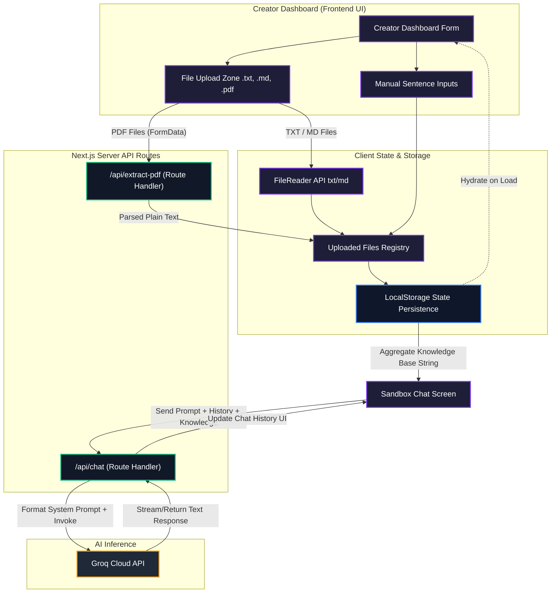
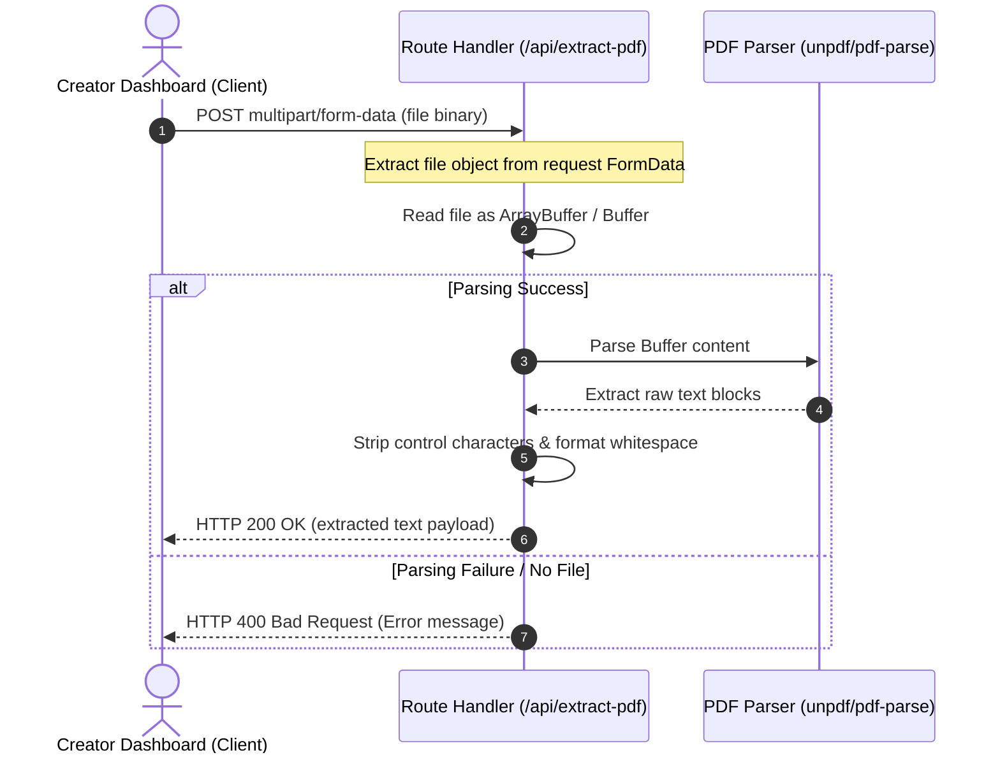
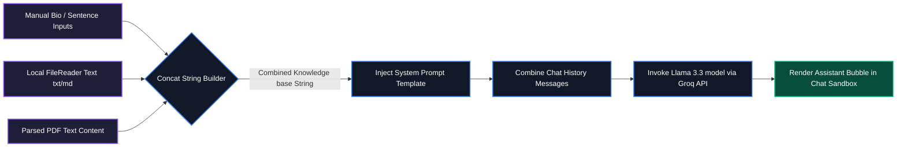

# Expert Twin System Flowcharts

This document visualizes the logical flows, data pipelines, and architecture of the **Expert Twin** platform, illustrating how manual inputs, file uploads (txt/md/pdf), server-side extraction, and LLM chat execution coordinate to simulate an AI twin.

## 1. Unified Architecture & Data Flow

This flowchart illustrates the end-to-end flow from the creator input phase to the real-time AI twin sandbox chat interface.

## 2. Server-side PDF Extraction Pipeline (`/api/extract-pdf`)

Here is the step-by-step pipeline mapping how a binary PDF file uploaded via a multi-part form is parsed securely on the server without local disk storage.

## 3. Dynamic System Prompt Compilation & LLM Chat Flow

This diagram demonstrates how manual inputs and multi-file text are merged to form the context injector used by the LLM system prompt.

