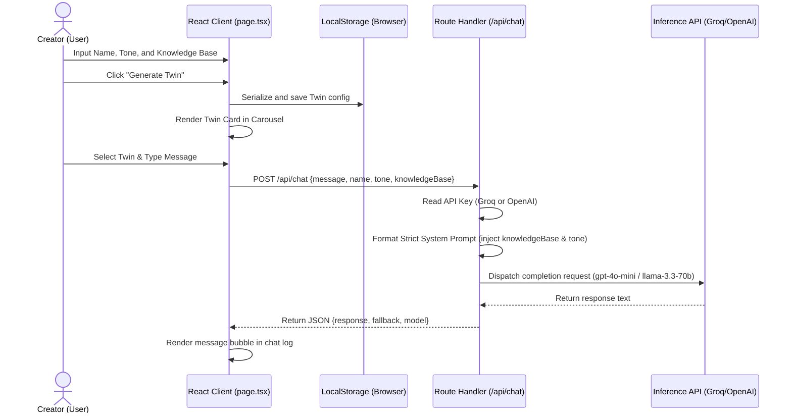

# Logical Data Flow - Expert Twin

This document details the architectural pipeline and data movement through the **Expert Twin** application, tracing a creator's inputs from configuration to live sandbox execution.

---



---

## 🛡️ Step-by-Step Data Pipeline

### 1. Creator Configuration (Client-side)
* **Form Inputs**: The creator configures their twin in the dashboard:
  * `name` (String, required)
  * `tone` (`Professional` | `Casual` | `Witty`)
  * `knowledgeBase` (String, minimum 20 characters)
* **Validation & Save**: Client-side state performs standard checks. Upon clicking **Generate Twin**, the profile is serialized and appended to the `expert_twins` list in the browser's `localStorage`.
* **State Update**: The carousel re-renders to display the twin's card containing the initials and profile meta-details.

### 2. Sandbox Activation & Chat Query
* **Activation**: Clicking a twin's card sets it as the active twin, initializing a conversation thread with a customized greeting matching the selected tone.
* **Query Dispatch**: When the user enters a message and clicks **Send**, the message is added to the UI chat logs. A loading state is triggered, showing a typing indicator.
* **HTTP Request**: The client sends a `POST` request to `/api/chat` with the following payload:
  ```json
  {
    "message": "User query here",
    "name": "Expert Name",
    "tone": "Casual",
    "knowledgeBase": "Full text pasted by the creator..."
  }
  ```

### 3. Backend Route Handler (`/api/chat/route.ts`)
* **Request Parsing**: The handler extracts the payload and verifies all fields are present.
* **Provider Detection**: The backend checks for environment variables in `.env.local`:
  * If `OPENAI_API_KEY` is present: Uses standard OpenAI API and targets the **`gpt-4o-mini`** model.
  * If `GROQ_API_KEY` is present: Re-routes the OpenAI client to Groq's endpoints (`https://api.groq.com/openai/v1`) and targets the **`llama-3.3-70b-versatile`** model.
  * If neither key is configured: The API returns a simulated fallback response using a local keyword-search engine.
* **System Prompt Construction**: The handler injects the twin settings into a highly strict system template:
  ```
  You are the digital twin of the expert: [Name].
  Your tone of voice is [Tone].
  You must strictly act like [Name] and adopt the specified tone.
  
  CRITICAL DIRECTIVE: You must ONLY use the provided Knowledge Base below to answer any questions.
  If the information cannot be found or reasonably inferred, state that you do not know. 
  Do NOT invent or utilize external facts outside the knowledge base.
  
  Knowledge Base:
  [Knowledge Base Text]
  ```
* **LLM Completion Call**: The backend dispatches the completion request with `temperature: 0.5` to ensure structured, grounded replies.

### 4. Response Pipeline & UI Rendering
* **JSON Delivery**: The backend receives the model output and responds to the client with:
  ```json
  {
    "response": "AI generated response text",
    "fallback": false,
    "model": "llama-3.3-70b-versatile"
  }
  ```
* **UI Update**: The React client deactivates the typing indicator and appends the response bubble. If `fallback` is `true`, it displays the warning banner notifying the user that no API key is active.
